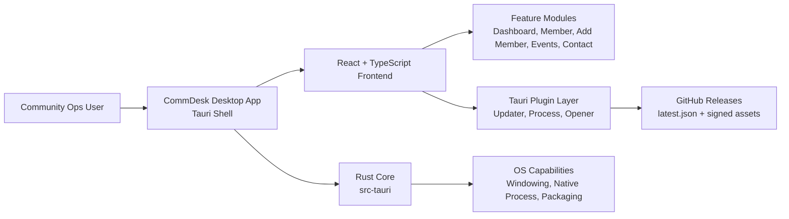
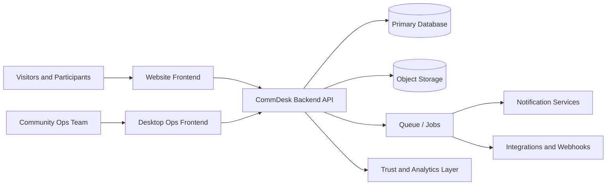
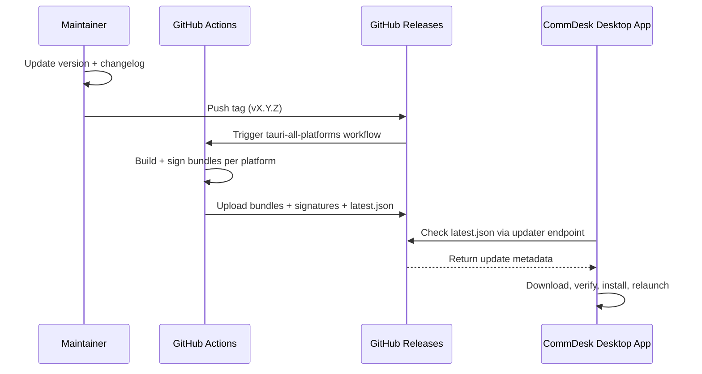

# CommDesk


An evolving desktop platform foundation to manage communities, events, hackathons, teams, and day-to-day operations.

[](https://github.com/NexGenStudioDev/CommDesk/blob/master/LICENSE)
[](https://github.com/NexGenStudioDev/CommDesk/issues)
[](https://github.com/NexGenStudioDev/CommDesk/pulls)
[](https://github.com/NexGenStudioDev/CommDesk/stargazers)

---

## Table of Contents

- [About](#about)
- [Implementation Status and Scope](#implementation-status-and-scope)
- [Product Architecture](#product-architecture)
- [Current Desktop Route Map](#current-desktop-route-map)
- [Quick Start (Desktop in 60 seconds)](#quick-start-desktop-in-60-seconds)
- [Core Features](#core-features)
- [Roles](#roles)
- [Tech Stack](#tech-stack)
- [Repository Structure](#repository-structure)
- [Prerequisites](#prerequisites)
- [Installation](#installation)
- [Important Scripts](#important-scripts)
- [Build & Packaging](#build--packaging)
- [Auto-Update Setup (Production)](#auto-update-setup-production)
- [Release Delivery Flow (Signed Updater)](#release-delivery-flow-signed-updater)
- [Release Steps](#release-steps)
- [Update Manifest (`latest.json`)](#update-manifest-latestjson)
- [Project Paths](#project-paths)
- [Recommended Checklist](#recommended-checklist)
- [Contributing](#contributing)
- [Community](#community)
- [Code of Conduct](#code-of-conduct)
- [License](#license)


## Nexus Spring of Code

## About

CommDesk is built for developer communities, student organizations, tech clubs, event organizers, and open-source teams.

It provides one desktop workspace for:

- Event planning and tracking
- Hackathon operations
- Member and team management
- Daily community coordination

---

## Implementation Status and Scope

CommDesk documentation includes both:

- target-state architecture docs (what the full platform should become)
- implementation status docs (what is currently built in this repository)

Before planning or estimating work, check:

- [Implementation Status Matrix (Android branch)](./docs/CommDesk-Implementation-Status.md)
- [Overall System Master Guide (target-state)](./docs/CommDesk-Overall-System-Summary.md)

If there is a mismatch between product-spec docs and current code in this repository, treat the implementation status matrix as source of truth for shipped scope.

---

## Product Architecture

### Current Repository Architecture (Implemented)

This reflects what is actively present in this repository today.



### Target Platform Architecture (Roadmap)

This reflects the broader target-state described in system docs.



### Documentation Index (Important)

Use these docs depending on your objective:

- Full product blueprint: [docs/CommDesk-Overall-System-Summary.md](./docs/CommDesk-Overall-System-Summary.md)
- What is currently implemented: [docs/CommDesk-Implementation-Status.md](./docs/CommDesk-Implementation-Status.md)
- Desktop vs website ownership: [docs/CommDesk-Frontend-Boundary-System.md](./docs/CommDesk-Frontend-Boundary-System.md)
- Events domain contract: [docs/CommDesk-Event-System.md](./docs/CommDesk-Event-System.md)
- RSVP lifecycle and controls: [docs/CommDesk-RSVP-System.md](./docs/CommDesk-RSVP-System.md)
- Judging lifecycle and auditability: [docs/CommDesk-Judging-System.md](./docs/CommDesk-Judging-System.md)
- Sponsor/partner lifecycle: [docs/CommDesk-Sponsor-Partner-System.md](./docs/CommDesk-Sponsor-Partner-System.md)

---

## Current Desktop Route Map

These are the currently mounted app routes in the desktop frontend shell.

| Route           | Screen              | Purpose                         |
| --------------- | ------------------- | ------------------------------- |
| `/`             | Dashboard           | Default landing screen          |
| `/dashboard`    | Dashboard           | Operations overview             |
| `/member`       | Members             | Member listing and search       |
| `/add-member`   | Add Member          | Member onboarding form          |
| `/events`       | Events              | Event listing and quick actions |
| `/create-event` | Create Event        | Event authoring UI              |
| `/contact`      | Contact and Support | Internal support submissions    |

---

## Quick Start (Desktop in 60 seconds)

```bash
git clone https://github.com/NexGenStudioDev/CommDesk.git
cd CommDesk
pnpm install
pnpm tauri dev
```

For production desktop bundles:

```bash
pnpm tauri build
```

---

## Core Features

### Community Management

- Member onboarding and role assignment
- Team structure and responsibility mapping
- Volunteer coordination

### Event Management

- Event creation and updates
- Registration and participant tracking
- Scheduling support

### Hackathon Management

- Hackathon setup and lifecycle management
- Team formation and project flow
- Submission and judging workflow

### Operations Dashboard

- Community activity overview
- Progress and task tracking

---

## Roles

| Role      | Description                          |
| --------- | ------------------------------------ |
| Visitor   | View public information              |
| Member    | Participate in events and hackathons |
| Volunteer | Assist with community operations     |
| Organizer | Manage events and programs           |
| Admin     | Full platform control                |

---

## Tech Stack

| Layer        | Technologies                           |
| ------------ | -------------------------------------- |
| Desktop App  | Tauri v2, React, TypeScript, Vite      |
| UI           | Tailwind CSS                           |
| Runtime      | Rust + Tauri                           |
| Auto Updates | GitHub Releases + Tauri updater plugin |
| Packaging    | Tauri bundles + Flatpak (Linux)        |

---

## Repository Structure

```text
CommDesk/
├── .github/
│   └── workflows/                     # CI/CD pipelines
├── docs/                              # project and operational docs
├── public/                            # static frontend assets
├── scripts/                           # build/release helper scripts
├── snap/                              # snap packaging assets
├── src/                               # React frontend
│   ├── Component/                     # shared UI components
│   ├── config/                        # frontend configuration
│   ├── features/                      # feature modules (Members, Events, etc.)
│   ├── system/                        # app system integrations (updater, etc.)
│   └── utils/                         # utility helpers
├── src-tauri/                         # Tauri Rust app
│   ├── src/                           # Rust source
│   ├── capabilities/                  # Tauri capability files
│   ├── icons/                         # app icons
│   └── tauri.conf.json                # Tauri runtime config
├── org.commdesk.CommDesk.json         # Flatpak manifest
├── package.json                       # JS scripts/dependencies
├── pnpm-lock.yaml                     # lockfile
├── CODE_OF_CONDUCT.md                 # community behavior guidelines
├── LICENSE                            # project license
└── README.md
```

---

## Prerequisites

- Node.js `>= 20`
- pnpm `>= 10`
- Rust stable (`rustup`, `cargo`)
- OS-specific Tauri dependencies:
  - Linux: WebKitGTK/GTK packages
  - macOS: Xcode Command Line Tools
  - Windows: MSVC build tools

Official guide: [Tauri Prerequisites](https://v2.tauri.app/start/prerequisites/)

---

## Installation

```bash
git clone https://github.com/NexGenStudioDev/CommDesk.git
cd CommDesk
pnpm install
```

---

## Important Scripts

| Script              | Command                    | Purpose                                |
| ------------------- | -------------------------- | -------------------------------------- |
| dev                 | `pnpm dev`                 | Start Vite dev server                  |
| build               | `pnpm build`               | Type-check + production frontend build |
| preview             | `pnpm preview`             | Preview built frontend                 |
| tauri               | `pnpm tauri`               | Run Tauri CLI commands                 |
| tauri:keys:generate | `pnpm tauri:keys:generate` | Generate updater signing keys          |
| tauri:build:signed  | `pnpm tauri:build:signed`  | Build signed updater artifacts         |
| lint                | `pnpm lint`                | Run ESLint                             |
| lint:fix            | `pnpm lint:fix`            | Auto-fix lint issues                   |
| format              | `pnpm format`              | Format all files with Prettier         |
| format:check        | `pnpm format:check`        | Validate formatting                    |

Most used commands:

```bash
# Run desktop app (dev)
pnpm tauri dev

# Build frontend only
pnpm build

# Build desktop bundles for current OS
pnpm tauri build
```

### Critical Maintainer Commands

```bash
# Install dependencies
pnpm install

# Run app in development mode
pnpm tauri dev

# Build production desktop bundles (current OS, unsigned/local)
pnpm tauri build


pnpm tauri signer generate

# Generate updater signing keys (IMPORTANT)
pnpm tauri:keys:generate

# Direct equivalent (important: do not add an extra `--` before `-w`)
pnpm tauri signer generate -w ~/.tauri/commdesk.key

# Build signed updater artifacts (uses ~/.tauri/commdesk.key by default)
pnpm tauri:build:signed

# Release version
git add .
git commit -m "release: v0.1.1"
git tag v0.1.1
git push origin master --tags

# Linux Flatpak build
flatpak-builder --force-clean flatpak-build org.commdesk.CommDesk.json
```

---

## Build & Packaging

### Tauri Bundles (current OS)

```bash
pnpm tauri build
```

Use `pnpm tauri:build:signed` when you need updater artifacts/signatures.

Artifacts are generated in:

- `src-tauri/target/release/`
- `src-tauri/target/release/bundle/`

Linux usually outputs:

- `.deb`
- `.rpm`
- `.AppImage`

### Flatpak Build (Linux)

Manifest:

- `org.commdesk.CommDesk.json`

Build command:

```bash
flatpak-builder --force-clean flatpak-build org.commdesk.CommDesk.json
```

---

## Auto-Update Setup (Production)

Configured in:

- `src-tauri/tauri.conf.json`
- `src/system/updater/autoUpdater.ts`
- `.github/workflows/tauri-all-platforms.yml`

### 1) Generate updater signing keys

```bash
pnpm tauri:keys:generate
```

Direct command equivalent:

```bash
pnpm tauri signer generate -w ~/.tauri/commdesk.key
```

This creates:

- Private key (secret, never commit)
- Public key (store in `src-tauri/tauri.conf.json` under `plugins.updater.pubkey`)

### 2) Local signed build environment

```bash
pnpm tauri:build:signed
```

The signed build script resolves key path in this order:

1. `TAURI_SIGNING_PRIVATE_KEY` (if already set)
2. `TAURI_SIGNING_PRIVATE_KEY_PATH` (custom key file path)
3. `~/.tauri/commdesk.key` (default)

### 3) GitHub Actions secrets

Set in repository secrets:

- `TAURI_SIGNING_PRIVATE_KEY`
- `TAURI_SIGNING_PRIVATE_KEY_PASSWORD`

### 4) Release workflow

Workflow file:

- `.github/workflows/tauri-all-platforms.yml`

This workflow:

- Builds Linux, Windows, macOS bundles
- Signs update artifacts
- Uploads bundles, `.sig` files, and `latest.json`

---

## Release Delivery Flow (Signed Updater)



---

## Release Steps

```bash
# 1) ensure code is ready
pnpm lint
pnpm build

# 2) commit release changes
git add .
git commit -m "release: v0.1.1"

# 3) tag and push
git tag v0.1.1
git push origin master --tags
```

Or run release workflow manually with `workflow_dispatch` and set `tag_name`.

---

## Update Manifest (`latest.json`)

Minimal example structure:

```json
{
  "version": "v0.1.1",
  "notes": "Release notes summary",
  "pub_date": "2026-03-18T00:00:00Z",
  "platforms": {
    "linux-x86_64": {
      "signature": "<signature>",
      "url": "https://github.com/NexGenStudioDev/CommDesk/releases/download/v0.1.1/commdesk_0.1.1_amd64.AppImage"
    }
  }
}
```

If you keep an internal template file, use `docs/latest.json.example`.

Runtime endpoint currently configured in app:

```text
https://github.com/NexGenStudioDev/CommDesk/releases/latest/download/latest.json
```

---

## Project Paths

- Frontend app entry: `src/App.tsx`
- Auto updater logic: `src/system/updater/autoUpdater.ts`
- Tauri app config: `src-tauri/tauri.conf.json`
- Rust dependencies and metadata: `src-tauri/Cargo.toml`
- Flatpak manifest: `org.commdesk.CommDesk.json`
- CI release workflow: `.github/workflows/tauri-all-platforms.yml`
- Updater production guide (recommended internal doc): `docs/Tauri_Auto_Update_Production_Guide.md`

---

## Troubleshooting

### Build fails on Linux due to missing WebKit/GTK packages

Install prerequisites from the Tauri guide and re-run:

```bash
pnpm install
pnpm tauri build
```

### Updater does not detect new release

Verify all of the following:

1. Tag was pushed (`vX.Y.Z`).
2. Workflow uploaded `latest.json` and signature files.
3. `plugins.updater.pubkey` in `src-tauri/tauri.conf.json` matches signing key.
4. Release assets are publicly accessible.

### Signed build fails locally

Check environment variables and key path resolution order:

1. `TAURI_SIGNING_PRIVATE_KEY`
2. `TAURI_SIGNING_PRIVATE_KEY_PATH`
3. `~/.tauri/commdesk.key`

---

## Recommended Checklist

Before every release:

1. `pnpm lint`
2. `pnpm build`
3. Confirm updater public key in `src-tauri/tauri.conf.json`
4. Confirm signing secrets exist in GitHub
5. Tag + push
6. Verify release assets and updater files

---

## Contributing

1. Fork repository
2. Create branch
3. Commit changes
4. Open pull request

Contribution permission note:
You may contribute through issues and pull requests, but the project source
code remains proprietary and all rights are reserved unless explicit written
permission is granted by the copyright holder.

```bash
git checkout -b feat/amazing-feature
```

---

## Community

- Issues: bug reports and feature requests
- Pull Requests: code contributions
- Discussions: ideas and technical questions

---

## Code of Conduct

This project is committed to a respectful and harassment-free community.

- Read and follow: [`CODE_OF_CONDUCT.md`](./CODE_OF_CONDUCT.md)
- Report behavior concerns to maintainers through: <https://github.com/NexGenStudioDev/CommDesk/issues>

---

## License

This project is proprietary and all rights are reserved.

Without explicit prior written permission, this software and source code may
not be copied, modified, distributed, or used.

- Full text: [`LICENSE`](./LICENSE)

---

Built with ❤️ for communities.
